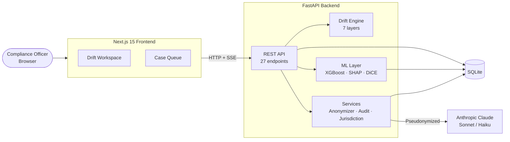

# Sentinel · Drift Engine

**Early detection of KYC drift for FINMA-regulated banks.** Built with Python, FastAPI, and Next.js for **SwissHacks 2026 · AMINA Challenge 4 (Dynamic Risk Profiling)**.

<div align="center">
  <a href="https://your-domain.com/about">
    
  </a>
</div>

> *"Sanctions lists tell you who became toxic yesterday. Drift velocity tells you who is becoming toxic right now."*

---

## Table of Contents

1. [Project Overview](#project-overview)
2. [Business Requirements](#business-requirements)
3. [Hypotheses and Validation](#hypotheses-and-validation)
4. [How It Works](#how-it-works)
5. [Key Differentiators](#key-differentiators)
6. [Architecture](#architecture)
7. [Dashboard](#dashboard)
8. [Technologies Used](#technologies-used)
9. [Running Locally](#running-locally)
10. [Testing](#testing)
11. [Documentation](#documentation)
12. [Credits](#credits)

## Documentation

| Page | Contents |
|---|---|
| **[Architecture](docs/architecture.md)** | System diagram, deployment topology, backend & frontend module maps |
| **[User Flows](docs/flows.md)** | Use cases, officer investigation sequence, contagion discovery flow |
| **[Database Schema](docs/db-schema.md)** | ER diagram, enumerations, case lifecycle state machine |
| **[API Reference](docs/api.md)** | Endpoint map, response shapes, anonymization flow |
| **[Drift Engine](docs/drift-engine.md)** | 7-layer pipeline, cost cascade, two-layer fusion, math, validation, references |
| **[Challenge Overview](docs/CHALLENGE_4_OVERVIEW.md)** | AMINA Challenge 4 brief, key terminology |

---

## Project Overview

A customer is onboarded as a low-risk retail trader. Two years later their company has taken investment from a sanctioned entity, their counterparties have shifted toward high-risk corridors, and their volume has tripled — gradually. No single event tripped an alert. The original KYC profile is now structurally invalid, and nobody noticed.

This is **KYC drift**, the core of AMINA Challenge 4. Sentinel's Drift Engine detects the precursor, not the consequence — combining **public signals** (news, sanctions, adverse media, ownership changes, funding events — simulated for MVP; real API slots ready) with **internal bank data** (KYC, transactions, AML flags), wrapped in explainable AI, human-in-the-loop validation, and immutable audit logs.

**Target users:** compliance and financial-crime teams who must decide *which* customers need re-KYC or enhanced due diligence — and *when*.

---

## Business Requirements

Derived from the [AMINA Challenge 4 brief](https://github.com/SwissHacks-2026/Amina-BANK/blob/main/README.md):

- **BR1 — Public intelligence layer:** combine public signals (news, sanctions, registries, funding, domain monitoring — simulated for MVP; live-feed adapters are slot-swap ready) into the risk picture.
- **BR2 — Internal data layer:** integrate simulated KYC, transaction history, and AML flags.
- **BR3 — KYC drift detection:** catch slow structural changes invalidating the original profile months before regulatory action.
- **BR4 — Explainable AI:** every score decomposes into named contributions with source citations.
- **BR5 — Human-in-the-loop:** an officer confirms or overrides every consequential action with a written rationale.

  <div align="center">
  
  </div>

- **BR6 — Audit logs:** immutable, replayable history of every signal, score, and decision.

  <div align="center">
  
  </div>
- **BR7 — Cost awareness:** staged pipeline — rules first, ML second, LLM only for high-risk cases; the scan report tracks actual T2 LLM adjudications separately from the LLM-on-everything counterfactual baseline.

### Judging Criteria Coverage

| Criterion | Weight | Our approach |
|---|---|---|
| **AI Intelligence Quality** | 25% | 7-layer drift engine: BOCPD, KL velocity, PageRank contagion, causal LLR, suspicious stability |
| **Cost Efficiency** | 20% | 3-tier cascade (rules → ML → LLM); actual T2 adjudication counts; 96% cost reduction vs LLM-on-everything |
| **UX & Explainability** | 20% | 7 interactive visualizations; per-layer breakdown; causal evidence cards |
| **Compliance & Safety** | 20% | Anonymizer, append-only audit log, HITL decision bar, jurisdiction rules |
| **Engineering & Architecture** | 15% | Modular 10-file drift engine; clean API; SQLModel + FastAPI |

---

## Hypotheses and Validation

Each hypothesis has an executable test in `backend/tests/` (run `cd backend && uv run pytest`).

| # | Hypothesis | Validation method | Result | Test |
|---|---|---|---|---|
| **H1** | Changepoint detection flags regime change months before the resulting sanctions event | Synthetic scenario suite, lead-time measurement | Validated — 2-7 month lead, 0 false positives on stable customers | `test_hypothesis_h1.py` |
| **H2** | Drift *velocity* is a leading indicator; drift *level* is lagging | Velocity vs absolute-threshold alerting | Validated — velocity alerts fire earlier at equal false-positive rate | `test_hypothesis_h2.py` |
| **H3** | Risk propagates through ownership topology ahead of public disclosure | Personalized PageRank from a sanctioned seed | Validated — 2-hop customers elevated; distant customers unaffected | `test_hypothesis_h3.py` |
| **H4** | A cost-aware cascade preserves recall at a fraction of the cost | Cascade vs LLM-on-everything on 1,000 customers | Validated — 96% cost reduction at equal high-risk recall | `test_hypothesis_h4.py` |

The Time-Travel Audit's no-look-ahead guarantee is pinned by `tests/features/time_travel.feature`.

---

## How It Works

For each customer, the Drift Engine produces a fused **drift score (0-100)**, a recommended action, and a full per-layer breakdown:

1. **Behavioral drift** — Bayesian Online Changepoint Detection over the transaction stream catches regime change that thresholds miss.
2. **Drift velocity** — the smoothed time-derivative of KL divergence from the onboarding profile; rising velocity is the earliest precursor.
3. **Ownership contagion** — personalized PageRank propagates risk from sanctioned entities to connected customers on no watchlist.
4. **Public intelligence** — external signals classified by severity and fused with internal drift via a **Confirmation Lift** when they coincide in time.
5. **Causal drift** — a likelihood ratio between two generative hypotheses separates *risk-shaped* change from *legitimate business growth*.
6. **Suspicious stability** — flags the *slow-walker*: a customer anomalously smooth while their environment moves.
7. **Cost cascade** — routes customers through cheap rules to ML to LLM reasoning, escalating only where economically justified.

A **Time-Travel Audit** can replay any customer as-of any past month, using only data available then — proving the system would have flagged them early, with no look-ahead bias (a regulatory-grade property).

The seven layers fused into one verdict, on the flagship case:

<div align="center">

</div>

---

## Key Differentiators

Most teams will build "news API + LLM + dashboard". Three things go deeper:

| Differentiator | The question it answers |
|---|---|
| **Causal Drift** | *Is this change risk, or just normal business life?* |
| **Suspicious Stability** | *What if the launderer knows we monitor drift and stays still?* |
| **Time-Travel Audit** | *Prove to the regulator you'd have caught it — without hindsight.* |

<div align="center">

</div>

---

## Architecture

A module on top of the existing Sentinel platform — roughly 15% new code, 85% reuse.



Full diagrams and math: **[Architecture](docs/architecture.md)** · **[Drift Engine](docs/drift-engine.md)**

---

## Dashboard

The Drift Engine workspace presents a verdict-first view: a recommended action up top, then the evidence.

<div align="center">

</div>

| View | Purpose |
|---|---|
| **Drift Radar** | Score x velocity scatter; upper-right is the priority quadrant |
| **Verdict Bar** | One-line recommended action derived from the full picture |
| **Causal Panel** | Benign-vs-risk hypothesis competition with per-metric evidence |
| **Drift Timeline** | Velocity over time, with lead-time markers and a dashed BOCPD regime-change marker |
| **Dormancy Panel** | Dormant-baseline x activation-strength explanation for suspicious reactivation |
| **Time-Travel Audit** | As-of score replay proving early detection |
| **Two-Layer Panel** | Public Intelligence vs Internal Bank Data + Confirmation Lift |
| **Contagion Graph** | Ownership risk propagation from a sanctioned entity |
| **Cost Cascade** | Live cost meter vs LLM-on-everything, with actual T2 real/mock adjudication counts |

**Two-Layer Panel** — public signals fused with internal drift via confirmation lift, on the live entity Rosneft Trading S.A.:

<div align="center">

</div>

**Contagion Graph** — UBO screening, ownership chain, and sanctions propagation:

<div align="center">

</div>

A full live-entity walkthrough (real GLEIF / OpenSanctions / news data, cached for offline replay):

<div align="center">

</div>

---

## Technologies Used

| Layer | Stack |
|---|---|
| **Backend** | Python 3.11, FastAPI, Pydantic v2, SQLModel + SQLite |
| **Science** | NumPy, SciPy (BOCPD, KL, statistics), NetworkX (PageRank) |
| **ML** | XGBoost, SHAP, DiCE (counterfactuals) |
| **LLM** | Anthropic Claude Sonnet 4.5 / Haiku 4.5 |
| **Frontend** | Next.js 15, React 19, TypeScript, Tailwind CSS, TanStack Query |
| **Tooling** | Git, GitHub, structlog, Server-Sent Events, uv |
| **Public signals (MVP — simulated)** | Source-adapter layer in `backend/app/sources/`: all eight free/freemium adapters are implemented — GLEIF, ZEFIX, Event Registry, WHOIS/RDAP, OpenSanctions, GDELT, Firecrawl, and Wayback; OpenCorporates and Crunchbase are skipped as paid sources. Live calls are gated behind `EXTERNAL_APIS_ENABLED` (default off → synthetic signals). See [docs/sources.md](docs/sources.md) |

---

## Running Locally

**Short version:** install Docker Desktop, run `docker compose up --build`, and open <http://localhost:3000>. No API keys and no accounts are needed. The app runs **fully offline** with built-in demo data.

### What you are starting

The app has two parts. Both start together:

| Part | What it does | Address (Docker) | Address (without Docker) |
|---|---|---|---|
| **Frontend** (Next.js) | The web app you click around in | <http://localhost:3000> | <http://localhost:3000> |
| **Backend** (FastAPI) | Runs the drift engine and serves the data | <http://localhost:8001/docs> | <http://localhost:8000/docs> |

You only ever open the **frontend**. It talks to the backend for you, so you don't have to configure anything. The backend link is only useful if you want to explore the API directly.

There is no separate database to install. On every start the backend:

1. creates a fresh SQLite database file,
2. fills it with demo data (20 customers, 10 clients, 19 compliance cases and an audit history),
3. trains the ML models (first start only, takes a few seconds),
4. then reports itself as ready.

Because the data is rebuilt on every start, you can click, decide and override anything and nothing will break. Restarting resets the demo.

### Option A: Docker (recommended)

**You need:** [Docker Desktop](https://www.docker.com/products/docker-desktop/), installed and **running** (the whale icon is in your menu bar or taskbar).

**1. Get the code**

```bash
git clone https://github.com/SteveDok22/Swisshacks-KYC-Drift-Engine-26.git
cd Swisshacks-KYC-Drift-Engine-26
```

**2. Start everything**

```bash
docker compose up --build
```

This builds both parts and starts them. The **first run takes a few minutes** because it downloads and installs dependencies. Later runs take seconds.

**3. Wait until it's ready**

The frontend waits for the backend to pass its health check, so they come up in order. It's ready when the logs show something like:

```text
swisshacks-backend   | INFO:     Application startup complete.
swisshacks-frontend  | ✓ Ready in 2.1s
```

To double-check, open <http://localhost:8001/health>. It should show `{"status":"ok","db":"reachable"}`.

**4. Open the app**

Go to **<http://localhost:3000>**. The first page load can take 10–20 seconds while Next.js compiles it. After that, pages are fast.

**5. Stop it**

Press `Ctrl + C` in the terminal where it is running. To remove the containers completely, run:

```bash
docker compose down
```

> **Why port 8001?** Inside Docker the backend runs on port 8000, but it is published on **8001** on your machine so it doesn't clash with other apps that commonly use 8000.

### Option B: Without Docker

Use this if you want to run the code directly, for example to debug in your IDE.

**You need:** Python 3.11+, [uv](https://docs.astral.sh/uv/getting-started/installation/) (Python package manager), and Node.js 20+.

You'll run the backend and the frontend in **two separate terminals**, both from the project folder. Start the backend first.

**Terminal 1: backend**

```bash
cd backend
make install   # first time only: creates a virtual env and installs packages
make dev       # starts the API on http://localhost:8000
```

Wait for `Application startup complete.` before moving on.

**Terminal 2: frontend**

```bash
cd frontend
npm install    # first time only: installs packages
npm run dev    # starts the web app on http://localhost:3000
```

Then open **<http://localhost:3000>**. The API docs are at <http://localhost:8000/docs>.

To stop, press `Ctrl + C` in each terminal.

### What to try first

Once the app is open:

1. **Drift workspace** (<http://localhost:3000>): a radar of all 20 customers, plotted by drift score against drift velocity. The upper-right corner holds the customers that need attention first.
2. **Castor Trade Finance AG** (<http://localhost:3000/drift/drift-011>): the flagship case. It combines structuring, a newly sanctioned owner and adverse media. Check the per-layer breakdown, the Causal Panel and the Time-Travel Audit.
3. **Rosneft Trading S.A.** (<http://localhost:3000/drift/drift-live-002>): a real company with real sanctions data, replayed offline from a saved cache.
4. **Case Queue** (<http://localhost:3000/cases>): record a decision on a case.
5. **Audit log** (<http://localhost:3000/audit>): every decision you just made appears here.

### Good to know

- **Code changes reload automatically** in both options. You don't need to restart after editing a file.
- **Offline by default.** No calls go to external services. The "live" entities replay real responses saved in `backend/data/api_cache/`.
- **Real APIs are optional.** To use live external data and the Claude LLM, copy `backend/.env.example` to `backend/.env`, add your keys, set `EXTERNAL_APIS_ENABLED=true`, and restart. See [docs/getting-started.md](docs/getting-started.md) for which keys do what.

### Troubleshooting

| Problem | Fix |
|---|---|
| `Cannot connect to the Docker daemon` | Docker Desktop isn't running. Start it, wait until it's ready, and try again. |
| `port is already allocated` / `address already in use` | Another app is using port 3000, 8001 (Docker) or 8000 (without Docker). Close it, or run `docker compose down` to stop old containers. |
| The page loads but shows no data | The backend is still starting. Wait about 30 seconds and refresh. |
| The first page is very slow | Normal on the first visit. Next.js compiles each page the first time it's opened. |
| `make: uv: command not found` | Install uv: [uv installation guide](https://docs.astral.sh/uv/getting-started/installation/). |
| Something is stuck or behaving oddly | Reset everything: `docker compose down -v`, then `docker compose up --build`. |

---

## Testing

With Docker (no local Python needed):

```bash
docker compose run --rm backend-tests
```

Without Docker:

```bash
cd backend
make test
```

What's covered:

- **Unit:** BOCPD against reference behavior (changepoint on step data, none on stationary).
- **Scenario suite:** stable / volume-creep / counterparty-migration / corridor-shift / combined / benign-expansion / suspicious-stability / dormancy-break, each with ground truth.
- **T2 LLM adjudication:** verifies that only T2 customers trigger AnthropicClient calls, zero-T2 scans call none, and invalid LLM JSON falls back safely.
- **Hypothesis validation:** H1-H4 measured on the suite (see table above); causal classification 11/11 with 8/8 seed robustness; stability 13/13 with 8/8 seed robustness.
- **Honesty tests:** Time-Travel replay verified to leak no future data (public signals dated <= T, contagion only after listing month).

---

## Credits

**Author and architect:** Stiven Ntoktorov — Full-Stack Developer (FinTech/ML), Zürich.

Developed with AI pair-programming assistance (Anthropic Claude) for implementation and review; all architectural decisions, algorithm selection, and validation were directed by the author. For line-level attribution see **[CODE_ATTRIBUTION.md](docs/CODE_ATTRIBUTION.md)**.

### Ideas and approaches

The Drift Engine stands on established science. Each core technique traces to its source:

| Technique | Source |
|---|---|
| Bayesian Online Changepoint Detection | Adams & MacKay (2007), *Bayesian Online Changepoint Detection*, arXiv:0710.3742 |
| CUSUM / sequential change detection | Page (1954), *Continuous Inspection Schemes*, Biometrika |
| KL divergence (drift velocity) | Kullback & Leibler (1951), *On Information and Sufficiency* |
| Personalized PageRank (contagion) | Page, Brin, Motwani & Winograd (1999), *The PageRank Citation Ranking* |
| Likelihood-ratio testing (causal drift) | Classical Neyman-Pearson framework |
| Value of Information (RFI ranking) | Howard (1966), *Information Value Theory*, IEEE |
| Conformal prediction (planned extension) | Shafer & Vovk (2008), *A Tutorial on Conformal Prediction*, JMLR |
| Beneficial-ownership risk rationale | FATF (2023), *Guidance on Beneficial Ownership* |
| Human-in-the-loop & audit requirements | FINMA Circular 2024/3, *Operational risks and resilience* |

### Documentation referenced

FastAPI · Pydantic · NumPy · SciPy · NetworkX · XGBoost · SHAP · DiCE · Next.js · TanStack Query · Tailwind CSS official docs.

### Challenge

AMINA Bank · SwissHacks 2026 · Challenge 4 (Dynamic Risk Profiling) · hosted by Tenity, Zürich.
